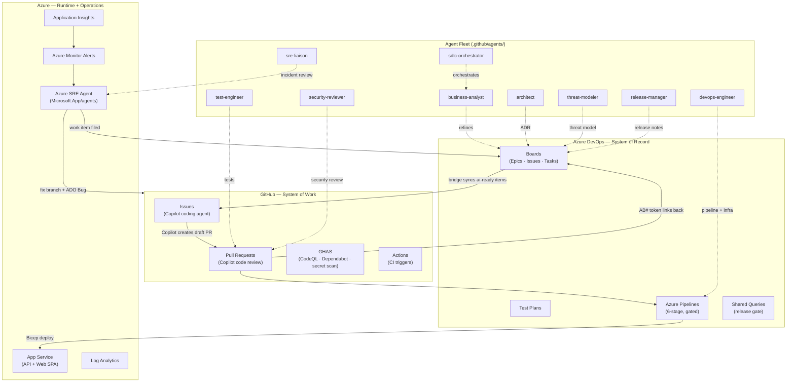

# Agentic SDLC Accelerator

> **Demonstration accelerator.** This is a working reference implementation, not a production-ready product. It is designed to be shown to enterprise customers and adapted for their context. See `docs/00-quickstart.md` to get running.

This repository shows how **Azure DevOps**, **GitHub**, and **Azure** combine into one governed, traceable software development lifecycle where AI agents participate at every stage — from backlog refinement to incident remediation — while humans hold the decisions that matter.

---

## Architecture

---

## Agent fleet

| Agent | Where it runs | Role |
|---|---|---|
| `sdlc-orchestrator` | Copilot Chat | Drives work items through the lifecycle; enforces stage gates |
| `business-analyst` | Copilot Chat | Refines Epics into acceptance-criteria-backed work items |
| `architect` | Copilot Chat | Produces Architecture Decision Records |
| `threat-modeler` | Copilot Chat | STRIDE threat modelling; adds security acceptance criteria |
| `test-engineer` | Copilot Chat | Writes tests; mirrors results into Azure Test Plans |
| `security-reviewer` | Copilot Chat | Reviews PRs for exploitable vulnerabilities |
| `devops-engineer` | Copilot Chat | Authors pipelines, Bicep, and release gate configuration |
| `release-manager` | Copilot Chat | Produces release notes and readiness summaries |
| `sre-liaison` | Copilot Chat | Reviews SRE Agent remediation; closes incidents as backlog |
| GitHub Copilot coding agent | GitHub (cloud) | Implements issues as draft PRs; assigned by the bridge |
| Copilot code review | GitHub (PR) | Automated PR review on every pull request |
| **Azure SRE Agent** | Azure (managed service) | Detects, investigates, mitigates, and files incidents |

The first nine are *authored agents* — prompt files in `.github/agents/`. The last three are *platform capabilities* configured rather than authored.

---

## What is real vs what needs configuring

| Component | Status |
|---|---|
| Reference app (Contoso Claims API + Web) | Working — 126 tests passing |
| Agent fleet definitions | Written — use in any GitHub Copilot-enabled org |
| ADO bootstrap script | Working — tested against `melrasheed/Agentic SDLC` |
| ADO–GitHub bridge | Working — synced AB#2 and AB#3 with write-back verified |
| Bicep infrastructure | Validated — `az bicep build` and `az deployment group validate` clean |
| Azure Pipelines YAML | Authored — requires a service connection and variable groups (portal steps) |
| Azure SRE Agent | Bicep module ready — GitHub/ADO connectors require portal setup |
| MCP server config | Template only — paths and tokens are per-user |

---

## Quickstart

See **[docs/00-quickstart.md](docs/00-quickstart.md)** — get running in under 30 minutes.

Full tutorial: **[docs/01-tutorial.md](docs/01-tutorial.md)**

---

## Documentation index

| Document | Purpose |
|---|---|
| [docs/README.md](docs/README.md) | Docs index |
| [docs/00-quickstart.md](docs/00-quickstart.md) | Prerequisites and fast-path setup |
| [docs/01-tutorial.md](docs/01-tutorial.md) | Complete numbered walkthrough |
| [docs/02-agent-catalog.md](docs/02-agent-catalog.md) | All 11 agents: purpose, inputs, guardrails |
| [docs/03-branch-and-pr-policy.md](docs/03-branch-and-pr-policy.md) | Branch strategy and PR rules |
| [docs/04-release-gates.md](docs/04-release-gates.md) | Pipeline stages, gates, and rollback |
| [docs/05-security-model.md](docs/05-security-model.md) | Threat model of the system itself |
| [docs/06-sre-runbook.md](docs/06-sre-runbook.md) | Azure SRE Agent setup and fault-injection demo |
| [docs/07-troubleshooting.md](docs/07-troubleshooting.md) | All 10 known bugs with symptoms and fixes |
| [docs/08-demo-script.md](docs/08-demo-script.md) | Timed 20-minute live demo runbook |

## Starter kit

**[starter-kit/](starter-kit/)** — the app-agnostic subset you adapt for a customer's own application. See `starter-kit/README.md`.

---

> **This is a demonstration accelerator.** Commands are real and verified against the `melrasheed/Agentic SDLC` Azure DevOps project and the `melrasheed/contoso-claims-agentic-sdlc` GitHub repository. Some steps require Azure portal actions that cannot be automated. Preview features are clearly labelled.
