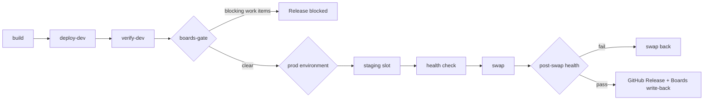

# 04 — Release gates

> Delivery runs on **GitHub Actions**. Azure DevOps is used for planning only — with one deliberate exception, described below, where Azure Boards remains the authority over whether a release may proceed.

---

## The delivery workflow

`.github/workflows/cd.yml` replaces the entire Azure Pipelines definition.



| Job | Environment | Blocking | Purpose |
|---|---|---|---|
| `build` | — | Yes | Install, lint, typecheck, tests, build, package API and SPA, upload artefacts |
| `deploy-dev` | `dev` | — | Zip-deploy both apps to the dev App Service |
| `verify-dev` | — | Yes | Smoke test `/health`, `/api/claims`, `/api/stats` and the SPA root, with retries for cold start |
| `boards-gate` | — | **Yes** | Query Azure Boards; fail while blocking work items are open |
| `deploy-prod` | `prod` | Gated | Deploy to the staging slot, health check, swap, and swap back on failure |
| `post-deploy` | — | — | Create the GitHub Release and comment on the shipped work items in Azure Boards |

Production only runs on a deliberate `workflow_dispatch` with `deploy-prod: true`. A push to `main` deploys to dev and evaluates the gate; it never reaches production on its own.

---

## Coming from Azure Pipelines? Read this table first

Every control from the old model still exists. Most moved; one had to be built.

| Azure Pipelines | GitHub equivalent | Notes |
|---|---|---|
| Stage | Job with `needs:` | |
| Environment + **Approvals** check | GitHub Environment + **required reviewers** | Configured by `tools/configure-github-environments.ps1` |
| **Business Hours** check | Environment **wait timer** | Approximate — a delay, not a calendar |
| **Exclusive Lock** check | `concurrency:` group | `cancel-in-progress: false` so releases queue rather than cancel |
| **Query Work Items** check | **Nothing native — `tools/delivery/boards-gate.mjs`** | The one real gap. See below |
| Service connection | **OIDC federated credential** | No secret to store or rotate |
| Variable group | Repository / environment variables | Non-secret identifiers stay variables so logs stay readable |
| Publish/download artifacts | `actions/upload-artifact` / `download-artifact` | |
| Deployment job with slot swap | `az webapp deployment slot swap` in a step | Same underlying Azure operation |

---

## The Azure Boards release gate

### Why this exists

Azure Pipelines ships a **Query Work Items** check: hold the release while an active Sev1 bug exists. It is the control that stops a team shipping on top of a known production defect.

GitHub Environments have required reviewers, wait timers and branch policies. They **cannot consult an external backlog**. Moving delivery to Actions therefore loses the control unless you rebuild it.

`tools/delivery/boards-gate.mjs` rebuilds it. It runs as an ordinary job, so Azure Boards stays authoritative over releases without Azure DevOps running the release.

### How it works

```yaml
- name: Check Azure Boards for blocking work items
  env:
    ADO_ORGANIZATION: melrasheed
    ADO_PROJECT: Agentic SDLC
    ADO_QUERY_PATH: Shared Queries/Release Gate - active Sev1 Sev2 bugs
    GATE_MAX_BLOCKING: '0'
  run: node tools/delivery/boards-gate.mjs
```

The script authenticates with the Entra ID token from the preceding `azure/login` step (or an `ADO_PAT` where OIDC to Azure DevOps is unavailable), resolves the **named shared query**, runs it, and fails the job when the result count exceeds `GATE_MAX_BLOCKING`. It writes a job summary naming every blocking work item with a direct link.

### Three design decisions worth defending

**1. It uses a named shared query, not inline WIQL.**
The definition of "blocking" lives in Azure DevOps where a delivery manager can see and change it, rather than in YAML that only engineers can edit. Change the rule, and every future release respects it without a code change.

**2. It fails closed.**
If Azure DevOps is unreachable, the gate blocks. A control that cannot evaluate its condition must not permit the action it guards. The cost is real — an Azure DevOps outage stops your releases — and the escape hatch is `GATE_FAIL_ON_ERROR=false`, to be used only with a recorded, accepted risk.

**3. It runs *before* the production approval.**
A gate after the approval is theatre: the human has already said yes. Placing it before means the reviewer is only ever asked to approve a release that is already known to be clear.

### Configuration

| Variable | Default | Purpose |
|---|---|---|
| `ADO_ORGANIZATION` | — | Organisation name, not URL |
| `ADO_PROJECT` | — | Project name |
| `ADO_QUERY_PATH` | — | Shared query path (preferred) |
| `ADO_WIQL` | — | Raw WIQL, used only when no query path is given |
| `GATE_MAX_BLOCKING` | `0` | Tolerated matches before blocking |
| `GATE_ENFORCE` | `true` | `false` reports without failing — useful for demos |
| `GATE_FAIL_ON_ERROR` | `true` | `false` lets query errors pass. Think hard |
| `ADO_PAT` | — | Optional. Omit to use Entra ID via `azure/login` |

### Seeing it work

The backing query is created by `tools/ado-bootstrap/bootstrap.ps1`. On the Agile process, the query filters on `[Microsoft.VSTS.Common.Severity] <= 2` (Sev1 and Sev2) and `[System.WorkItemType] = 'Bug'` with an open state (`Active`, `New`). The Severity field is available on Agile; it was not available on the Basic process.

To watch it block, then pass:

```powershell
# Work item #4 is an open Sev1 bug, so this run fails at the gate
gh workflow run cd.yml -f gate-only=true

# Close #4 in Azure Boards (Resolved or Closed state), then re-run - the gate now passes
gh workflow run cd.yml -f gate-only=true
```

---

## GitHub Environment protection

Applied by `tools/configure-github-environments.ps1`.

### `dev`

Deliberately unprotected. Dev exists to surface problems early, and a gate that delays feedback on a dev deployment has negative value.

### `prod`

| Rule | Setting | Replaces |
|---|---|---|
| Required reviewers | Named humans | ADO Approvals check |
| Prevent self-review | On | "requester cannot be approver" |
| Wait timer | Optional delay | ADO Business Hours check |
| Deployment branch policy | Protected branches only | ADO branch filter |

```powershell
./tools/configure-github-environments.ps1 `
    -Repository melrasheed/contoso-claims-agentic-sdlc `
    -Reviewers alice,bob `
    -WaitTimerMinutes 5
```

> **Plan limitation, stated plainly.** Deployment protection rules on **private** repositories require GitHub Pro, Team or Enterprise. On a free private repo the environment is created and the rules are silently ignored — the workflow appears to work while enforcing nothing. Verify on the environment settings page rather than assuming.

### Environment-scoped identity — the part most people miss

Federated credentials are scoped per environment:

```
repo:OWNER/REPO:environment:dev
repo:OWNER/REPO:environment:prod
```

A job can only obtain Azure credentials for production **after GitHub has satisfied the `prod` environment's protection rules**. The approval requirement is therefore enforced by the identity system, not merely by workflow YAML that anyone with write access could edit.

That is a meaningfully stronger property than a shared service connection, and worth pointing out to a security reviewer.

---

## Deployment strategy and rollback

1. Deploy the API to the **staging slot**.
2. Health check the slot. If it never becomes healthy, stop — nothing has been swapped, so production is untouched.
3. **Swap** staging into production.
4. Health check production.
5. On failure, **swap back immediately**, mark the run failed, and write a rollback notice to the job summary.

Mitigate first, diagnose afterwards. The rollback is a swap, so it completes in seconds and does not depend on a rebuild.

### SKU requirements

| Configuration | SKU | Supports slots | Approx. monthly cost |
|---|---|---|---|
| Dev (`enableSlots=false`) | B1 | No | ~£26 for two apps on one plan |
| Prod (`enableSlots=true`) | S1 (automatic promotion) | Yes | ~£56 for one plan |

B1 does not support deployment slots. Setting `enableSlots=true` automatically promotes the plan to S1. This is intentional — silently shipping a workflow that fails at deploy time is worse than paying for S1.

---

## What is enforced where

| Control | Enforced by | Bypassable by |
|---|---|---|
| Tests, lint, typecheck | `ci.yml` + required status check | Nobody, without changing the ruleset |
| Code review | Branch ruleset, 1 approval, CODEOWNERS | Nobody |
| SAST / dependencies | `codeql.yml`, `dependency-review.yml` | Nobody |
| No open Sev1/Sev2 | **`boards-gate` job** | Editing `cd.yml` |
| Human approval for prod | `prod` environment reviewers | Repo admin changing environment settings |
| One release at a time | `concurrency` group | Editing `cd.yml` |
| Rollback on bad deploy | post-swap step | Editing `cd.yml` |

Note honestly that several controls live in workflow YAML, which anyone with write access can change. That is why `.github/workflows/` is a **CODEOWNERS-protected path** — changing a control becomes a reviewed act, and the audit trail shows who approved it.

---

## What the devops-engineer agent manages

The `devops-engineer` agent owns workflow and Bicep changes, and is explicitly instructed never to propose Azure Pipelines. Engage it with:

```
@devops-engineer
Add a performance test job to cd.yml that runs k6 after verify-dev and fails
if P95 latency exceeds 500ms. Do not block PR builds.
```

It will propose YAML changes, state the cost and blast radius, list anything a human must still configure, and refuse to add `continue-on-error` to make a run pass.

---

## Related

- [`09-why-this-split.md`](09-why-this-split.md) — why planning and delivery are deliberately separated
- [`05-security-model.md`](05-security-model.md) — OIDC federation and least privilege
- [`03-branch-and-pr-policy.md`](03-branch-and-pr-policy.md) — required checks before merge
- [`07-troubleshooting.md`](07-troubleshooting.md) — gate and OIDC failures

