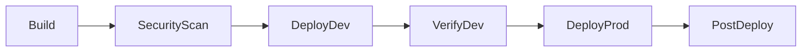

# 04 — Release gates

---

## Pipeline overview

The pipeline in `pipelines/azure-pipelines.yml` has six stages. The service connection name is `azure-svc-connection` (must be created as an OIDC / Workload Identity Federation connection — see below).



| Stage | Trigger | Blocking | Purpose |
|---|---|---|---|
| **Build** | Every push | Yes | `npm ci`, lint, typecheck, 126 unit tests, coverage, Vite build, publish artifacts |
| **SecurityScan** | After Build | Yes — High+ | `npm audit --audit-level=high`, CredScan, CodeQL placeholder |
| **DeployDev** | After SecurityScan (not PRs) | — | Bicep infra + API + Web SPA to dev |
| **VerifyDev** | After DeployDev | Yes | Smoke tests: `/health` and `/api/claims` |
| **DeployProd** | After VerifyDev (main branch only) | Gated | Bicep prod + API to staging slot → health check → swap → rollback |
| **PostDeploy** | After DeployProd | Yes | Final health check + App Insights release annotation |

---

## Service connection

**Recommended: Workload Identity Federation (no secrets)**

**[PORTAL]** Project Settings → Service connections → New → Azure Resource Manager → Workload identity federation (automatic).

- Name: `azure-svc-connection` (exact — the pipeline YAML references this name)
- Subscription: your target subscription
- Resource Group: leave blank (pipeline-level scope)
- Grant access to all pipelines, or lock to this pipeline

This creates a federated credential on a new App Registration. No client secrets to rotate.

> If OIDC is unavailable, fall back to Service Principal with certificate. Never use a plain client secret.

---

## Variable groups

Create in **Pipelines → Library → Variable Groups**.

### `agentic-sdlc-common`

| Variable | Purpose |
|---|---|
| `AZURE_SUBSCRIPTION_ID` | Azure subscription ID |
| `AZURE_TENANT_ID` | Azure tenant ID |
| `NAME_PREFIX` | Resource name prefix (e.g. `contoso`) |
| `ALERT_EMAIL` | Ops team email for alert notifications |

### `agentic-sdlc-dev`

| Variable | Purpose |
|---|---|
| `VITE_API_BASE_URL` | API URL **set before build** (Vite inlines at build time, not runtime) |
| `AZURE_RESOURCE_GROUP` | Dev resource group name |
| `AZURE_LOCATION` | Azure region |

### `agentic-sdlc-prod`

| Variable | Purpose |
|---|---|
| `VITE_API_BASE_URL` | Prod API URL |
| `AZURE_RESOURCE_GROUP` | Prod resource group name |
| `AZURE_LOCATION` | Azure region |

> **Vite build-time note.** `VITE_API_BASE_URL` is **inlined at build time** by Vite. The value in the variable group must be correct before the Build stage runs. It is not read at runtime. The app setting on the Web App is a documentation marker only.

---

## Environments

Create in **Pipelines → Environments**.

| Environment | Purpose |
|---|---|
| `dev` | Auto-deploy — no approval gates |
| `prod` | Gated — approvals + checks (see below) |

---

## Gates on the `prod` environment

Gates are configured on the **environment** in the Azure DevOps portal, not in YAML. Running `pipelines/configure-checks.ps1` automates what is API-configurable. The rest requires the portal.

### Run configure-checks.ps1

```powershell
.\pipelines\configure-checks.ps1 `
    -Organization <your-ado-org> `
    -Project "Agentic SDLC" `
    -EnvironmentName prod
```

This configures Business Hours and Exclusive Lock checks via the REST API.

### Gate 1: Query Work Items **[PORTAL — required]**

Blocks deployment if any active Sev1 or Sev2 bugs exist.

1. Create a shared query in **Boards → Queries → New → Shared Queries**:
   - Name: `Active Critical Bugs`
   - Type: Flat list
   - Filter: Work Item Type = Bug AND Severity IN (1, 2) AND State NOT IN (Closed, Done)
   - Save to: Shared Queries / Agentic SDLC

   > **Note for Basic process.** The Basic process has no Bug type. The bootstrap script creates this query; on a Basic project it will return zero results and the gate will always pass. If you switch to Agile or Scrum, update the query filter.

2. Add the check:
   - Environments → `prod` → Approvals and checks → + → Query Work Items
   - Query: `Active Critical Bugs`
   - Maximum threshold: `0`

### Gate 2: Business Hours (automated by configure-checks.ps1)

- Days: Monday–Friday
- Hours: 09:00–17:00 UTC
- Blocks unattended production deployments outside working hours

### Gate 3: Exclusive Lock (automated by configure-checks.ps1)

Prevents two concurrent deployments to the `prod` environment. One release at a time.

### Gate 4: Approvals **[PORTAL — required]**

**[PORTAL]** Environments → `prod` → Approvals and checks → + → Approvals

- Add your release manager or approval group
- Instructions: "Confirm no active Sev1/Sev2 issues and business hours check is satisfied."
- Recommended: require at least two approvers, at least one outside the authoring team.

---

## Prod deployment: slot swap and rollback

The DeployProd stage uses a staging slot pattern. This requires Standard tier or above — the Bicep parameterises this automatically when `enableSlots=true`.

```
slot deployment:
  deploy API code → staging slot
  run health check against staging slot URL
  if healthy → swap staging ↔ production
  if unhealthy → stop, alert, swap back
```

### SKU requirements

| Configuration | SKU | Supports slots | Approx. monthly cost |
|---|---|---|---|
| Dev (`enableSlots=false`) | B1 | No | ~£26 for two apps on one plan |
| Prod (`enableSlots=true`) | S1 (automatic promotion) | Yes | ~£56 for one plan |

B1 does not support deployment slots. Setting `enableSlots=true` automatically promotes the plan to S1. This is intentional — silently shipping a pipeline that fails at deploy time is worse than paying for S1.

Explicit prod parameters file (`infra/main.parameters.prod.json`) sets `enableSlots=true` and `sku=S1` directly.

### Auto-rollback

If the health check against the production slot fails after swap, the PostDeploy stage swaps back immediately:

```
post-deploy:
  run health check against production
  if fails → swap back to staging → exit failure → alert
```

---

## CodeQL (GHAS for ADO)

Full CodeQL analysis requires GitHub Advanced Security (GHAS) for Azure DevOps.

**[PORTAL]** Project Settings → Microsoft Security → GitHub Advanced Security → Enable.

Then in `pipelines/templates/security-scan-job.yml`, replace the placeholder with:
```yaml
- task: AdvancedSecurity-Codeql-Init@1
  inputs:
    languages: 'javascript'
- task: AdvancedSecurity-Codeql-Autobuild@1
- task: AdvancedSecurity-Codeql-Analyze@1
```

The placeholder in the current file runs a basic audit check. GHAS is not required to run the demo.

---

## Importing the pipeline

**[PORTAL]** Azure DevOps → Pipelines → New Pipeline:

1. Where is your code? → GitHub (OAuth or PAT)
2. Select repository: `<owner>/contoso-claims-agentic-sdlc`
3. Configure your pipeline → Existing Azure Pipelines YAML file
4. Branch: `main`, Path: `/pipelines/azure-pipelines.yml`
5. **Save** (do not run yet — set up variable groups and service connection first)

---

## What the devops-engineer agent manages

The `devops-engineer` agent owns pipeline and Bicep changes. Engage it with:

```
@devops-engineer
Add a performance test stage to the pipeline that runs k6 after VerifyDev 
and fails if P95 latency exceeds 500ms. Do not block PR builds.
```

It will propose YAML changes, state the cost and blast radius, list any required portal steps, and note that the change must not add `continueOnError` to pass.
