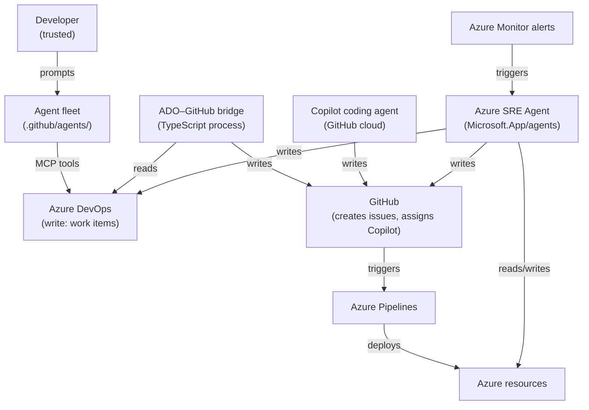

# 05 — Security model

This document models the security of the **Agentic SDLC Accelerator system itself** — not the Contoso Claims application. The threat model for the claims application is in `docs/threat-models/`.

---

## System boundary

The system that requires modelling consists of:

1. **The agent fleet** — nine prompt files that direct AI behaviour across the whole SDLC.
2. **The ADO–GitHub bridge** — a TypeScript process with write access to both Azure DevOps and GitHub.
3. **The Azure Pipelines** — a multi-stage pipeline with Azure deployment rights.
4. **The Azure SRE Agent** — a managed Azure service with read/write access to Azure resources, GitHub, and Azure DevOps.
5. **The MCP server configuration** — credentials that grant the agent fleet access to Azure DevOps.

---

## Trust model

| Actor | Trust level | Can write to production? |
|---|---|---|
| Human developer | Trusted | No — must go through pipeline gates |
| Authored agent (prompt file) | Constrained | Only through ADO work items and GitHub issues |
| Copilot coding agent | Limited | No — creates draft PRs only; cannot merge or approve |
| ADO–GitHub bridge | Service | No — creates GitHub issues and updates ADO work items; does not touch Azure |
| Azure Pipelines | Service (OIDC) | Yes — but only via approved pipeline stages and environment gates |
| Azure SRE Agent | Managed service | Reads: yes. Writes: only when `accessLevel=High` and tools are set to Allow/Ask |
| GitHub Actions `GITHUB_TOKEN` | Limited | Can push code; cannot assign Copilot coding agent (needs PAT) |

---

## What an AI agent can and cannot do

### Authored agents (prompt files)

Authored agents are grounded by `.github/copilot-instructions.md`. The guardrails stated there are not technical controls — they are prompt-level constraints. A sufficiently adversarial or confused prompt could elicit behaviour outside them.

**Cannot** (enforced by platform):
- Merge or approve pull requests
- Push to protected branches
- Alter branch protection rules
- Access secrets stored in GitHub Actions or Azure Key Vault

**Should not** (enforced by prompt — verify agent behaviour):
- Start coding without a linked work item
- Skip a lifecycle stage gate
- Invent business rules

**Assessment:** Prompt-level guardrails are weaker than platform controls. For regulated environments, pair them with branch protection rules, required approvals, and CODEOWNERS. The authored agents are an advisory layer, not an enforcement layer.

### Copilot coding agent

**Cannot** (enforced by GitHub platform):
- Approve its own pull request
- Push directly to protected branches
- Access repository secrets not explicitly granted to the agent
- Assign itself with the `workflow` scope unless the token has it

**Can:**
- Create branches, commit code, open draft PRs
- Read all repository content
- Trigger pipeline runs via PR creation (indirectly)

**Key risk:** The agent's output is only as safe as the issue it was given. A maliciously crafted issue body could elicit a PR with dangerous code. Mitigations: CODEOWNERS-enforced human review, security-reviewer agent engagement on every PR.

### Azure SRE Agent

**In Review mode:** The agent cannot act without human approval on each step. This is the appropriate default for demos and initial production deployments.

**In Automatic mode:** Tools marked `Ask` execute without human approval. This is a significant governance decision. Mitigations:
- Use Parameter Policy to restrict tool arguments (e.g., restrict `az webapp restart` to specific app names).
- Set `Deny` on all destructive tools.
- Scope `accessLevel=Low` to prevent Contributor role assignment.
- Set `monthlyAgentUnitLimit` to cap spend and limit blast radius.

> **Critical:** In Automatic mode, a compromised alert rule or a misconfigured incident could cause the agent to take destructive action autonomously. Design the Parameter Policy as if the agent will be triggered by an adversary.

---

## Secret handling

### What is a secret in this system

| Item | Where it lives | Access method |
|---|---|---|
| Azure subscription credentials | Azure Pipelines service connection | OIDC federation — no secret |
| Azure runtime credentials | App Service managed identity | No secret — platform-assigned |
| ADO API token (bridge) | Environment variable (`ADO_PAT`) or Entra ID | Prefer Entra; PAT if required |
| GitHub token (bridge) | Environment variable (`GITHUB_TOKEN`) | PAT with minimum required scopes |
| MCP server token | `~/.copilot/mcp-config.json` | Per-user credential — never committed |

**Rules enforced in `.github/copilot-instructions.md`:**
- No secrets in source, ever — including tests, comments, sample `.env` files, or documentation examples.
- Authenticate to Azure with managed identity.
- Authenticate pipelines with OIDC.
- GitHub token scopes: `repo` + `issues` for normal bridge operation; add `workflow` only if the bridge must push to `.github/workflows/`.

### OIDC for the pipeline

The pipeline service connection uses Workload Identity Federation. Azure DevOps is federated as an identity provider on an App Registration. No client secret is created or rotated. The pipeline receives a short-lived OIDC token at runtime.

---

## GHAS and supply-chain security

| Control | What it detects | Configuration |
|---|---|---|
| CodeQL (GHAS for ADO) | Code vulnerabilities in TypeScript | Enable per `pipelines/README.md` §CodeQL |
| `npm audit` | Known CVEs in dependencies | Runs in SecurityScan stage; blocks on High+ |
| Dependabot | Outdated and vulnerable packages | Configure in GitHub Security settings |
| CredScan (Microsoft Security DevOps) | Committed secrets | Runs in SecurityScan stage |
| Secret scanning | Secrets pushed to GitHub | GitHub Security → Secret scanning |

---

## Provenance and audit trail for AI-authored changes

Every AI-generated change must be traceable from a regulatory standpoint. The system creates this trail as follows:

| Event | Record |
|---|---|
| Work item created/refined by agent | Azure Boards comment and state history |
| Issue created by bridge | GitHub issue body contains `AB#<id>` and a bridge attribution comment |
| Copilot opens a draft PR | PR author is `github-copilot[bot]`; PR body must tick the "GitHub Copilot coding agent" authorship checkbox |
| SRE Agent opens a fix branch | PR author is the SRE Agent service principal; ADO Bug is filed with remediation summary |
| Human merges | Merge commit records the approver identity |
| Pipeline runs | Azure DevOps pipeline run log records OIDC identity and deployment timestamp |

**The gap:** If the authorship checkbox in the PR template is not ticked, there is no automated enforcement. This is a process control. For regulated environments, consider a pipeline step that fails the PR if the authorship section is empty.

---

## Separation of duties for regulated industries

The governance argument for regulated industries (banking, insurance, healthcare):

| Requirement | How this system satisfies it |
|---|---|
| No single actor can both author and approve a change | Branch protection + CODEOWNERS; Copilot cannot approve its own PR |
| AI-generated changes are identifiable | Author field + PR authorship checkbox |
| AI-generated changes undergo human review | Required approvals; security-reviewer engagement |
| All production changes are traceable to a work item | `AB#<id>` in PR body; bridge creates the link; pipeline gates block on unlinked items |
| Production deployments are gated and time-controlled | Query Work Items gate; Business Hours gate; Approvals |
| Automated remediations are logged | SRE Agent files ADO Bug and GitHub issue; Review mode requires explicit approval |
| The system cannot be silently bypassed | Branch protection rules enforce the checks; `continueOnError` is forbidden by the devops-engineer agent's guardrails |

---

## What is not modelled here

- The security of the Contoso Claims application (API route authorisation, claim data protection, adjudication integrity) — see `docs/threat-models/`.
- Tenant isolation between customers if this is deployed in a multi-tenant context — out of scope for this demo.
- Supply-chain attacks on the agent fleet itself (adversarial prompt injection via issue bodies) — this is a known risk category; mitigations are human review and prompt hardening.
