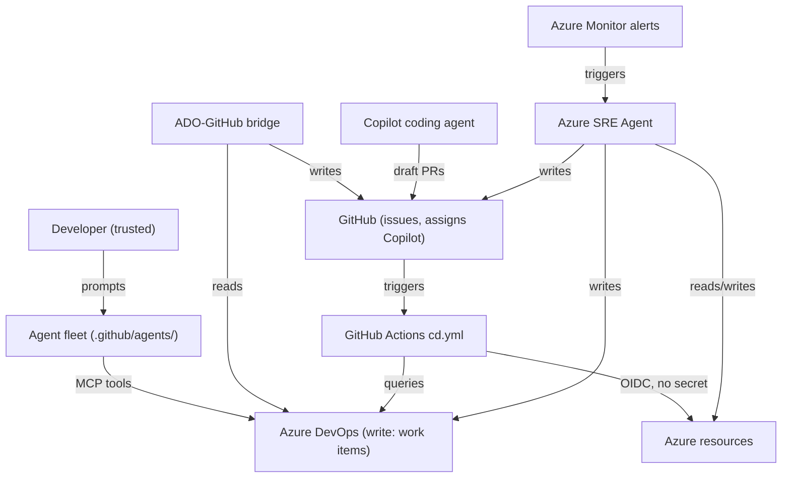

# 05 — Security model

This document models the security of the **Agentic SDLC Accelerator system itself** — not the Contoso Claims application. The threat model for the claims application is in `docs/threat-models/`.

---

## System boundary

The system that requires modelling consists of:

1. **The agent fleet** — nine prompt files that direct AI behaviour across the whole SDLC.
2. **The ADO–GitHub bridge** — a TypeScript process with write access to both Azure DevOps and GitHub.
3. **The GitHub Actions delivery workflow** — `cd.yml`, holding Azure deployment rights via OIDC federation.
4. **The Azure Boards release gate** — `tools/delivery/boards-gate.mjs`, a control with read access to Azure DevOps that decides whether a release proceeds.
5. **The Azure SRE Agent** — a managed Azure service with read/write access to Azure resources, GitHub, and Azure DevOps.
6. **The MCP server configuration** — credentials that grant the agent fleet access to Azure DevOps.



---

## Trust model

| Actor | Trust level | Can write to production? |
|---|---|---|
| Human developer | Trusted | No — must go through branch protection, the Boards gate and environment approval |
| Authored agent (prompt file) | Constrained | Only through ADO work items and GitHub issues |
| Copilot coding agent | Limited | No — creates draft PRs only; cannot merge or approve |
| ADO–GitHub bridge | Service | No — creates GitHub issues and updates ADO work items; does not touch Azure |
| GitHub Actions `cd.yml` | Service (OIDC) | Yes — but only from a job that has satisfied the `prod` environment's protection rules |
| Azure SRE Agent | Managed service | Reads: yes. Writes: only when `accessLevel=High` and tools are set to Allow/Ask |
| GitHub Actions `GITHUB_TOKEN` | Limited | Can push code; cannot assign Copilot coding agent (needs PAT) |

---

## Identity: no stored credentials

GitHub Actions authenticates to Azure with **OpenID Connect federation**. There is no client secret, no certificate and no publish profile anywhere in the repository.

```yaml
permissions:
  id-token: write        # allows GitHub to mint the OIDC token

- uses: azure/login@v2
  with:
    client-id: ${{ vars.AZURE_CLIENT_ID }}       # identifiers, not secrets
    tenant-id: ${{ vars.AZURE_TENANT_ID }}
    subscription-id: ${{ vars.AZURE_SUBSCRIPTION_ID }}
```

GitHub mints a short-lived token describing *which repository, which workflow and which environment* is asking. Azure validates it against a federated credential and returns an access token valid for minutes.

### Why the credentials are environment-scoped

The federated credentials are bound to specific subjects:

```
repo:OWNER/REPO:environment:dev
repo:OWNER/REPO:environment:prod
```

A job can only obtain production Azure credentials **after GitHub has satisfied the `prod` environment's protection rules** — required reviewers, self-review prevention, protected-branch policy.

This matters more than it first appears. With a shared service connection, the approval and the credential are independent: the workflow could be edited to deploy without approval and the credential would still work. Here, **the approval requirement is enforced by the identity system**. Skip the environment and the OIDC subject no longer matches, so `azure/login` fails.

Consequences worth stating:

- There is no long-lived credential to leak, rotate, or find in a log.
- A fork or a pull-request workflow cannot obtain the credential — the subject will not match.
- Compromising the repository is not sufficient to deploy to production.

### Least privilege

- The federated application holds **Contributor on one resource group**, not the subscription.
- Workflow `permissions:` are declared at workflow level and widened only where needed: `contents: write` appears solely on the job that creates a GitHub Release.
- At runtime the application uses **user-assigned managed identity**; no application secret exists.

---

## Separation of duties: the compliance argument

This is the property that makes AI-assisted delivery defensible in a regulated environment.

A developer with write access to the repository can change a workflow file. They **cannot** silently close the Sev1 work item in Azure Boards that is blocking the release. That is a different system, a different permission, and a visible act by a named person.

| Control | Lives in | Who can change it |
|---|---|---|
| Tests must pass | Repository ruleset | Repository admin |
| Code review required | Repository ruleset + CODEOWNERS | Repository admin |
| No open Sev1/Sev2 | **Azure Boards** | **Delivery manager — not the engineer** |
| Human approval for production | GitHub Environment | Repository admin |

Deliberately splitting the authority over "may this ship" from the authority over "what does the code do" turns a convention into a control. See `docs/09-why-this-split.md`.

### The gate fails closed

`tools/delivery/boards-gate.mjs` blocks the release when Azure DevOps cannot be reached. A control that cannot evaluate its condition must not permit the action it guards. The cost is real — an Azure DevOps outage stops releases — and the override (`GATE_FAIL_ON_ERROR=false`) exists but should require a recorded, accepted risk.

### Where the controls are weakest

Stated plainly, because a reviewer will find it:

- The gate and the concurrency lock live in **workflow YAML**, which anyone with write access can edit. Mitigated by making `.github/workflows/` a CODEOWNERS-protected path, so changing a control is a reviewed act with an audit trail — but a repository admin can still bypass review.
- Environment protection rules are **silently ignored on free private repositories**. Verify on the settings page; do not assume.
- `ADO_PAT`, where used instead of Entra ID, is a long-lived secret. Prefer OIDC.

---

## What an AI agent can and cannot do

### Authored agents (prompt files)

Authored agents are grounded by `.github/copilot-instructions.md`. The guardrails stated there are not technical controls — they are prompt-level constraints. A sufficiently adversarial or confused prompt could elicit behaviour outside them.

**Cannot** (enforced by platform):
- Merge or approve pull requests
- Push to protected branches
- Alter branch protection rules
- Access secrets stored in GitHub Actions or Azure Key Vault

**Should not** (enforced by prompt — verify agent behaviour):
- Start coding without a linked work item
- Skip a lifecycle stage gate
- Invent business rules

**Assessment:** Prompt-level guardrails are weaker than platform controls. For regulated environments, pair them with branch protection rules, required approvals, and CODEOWNERS. The authored agents are an advisory layer, not an enforcement layer.

### Copilot coding agent

**Cannot** (enforced by GitHub platform):
- Approve its own pull request
- Push directly to protected branches
- Access repository secrets not explicitly granted to the agent
- Assign itself with the `workflow` scope unless the token has it

**Can:**
- Create branches, commit code, open draft PRs
- Read all repository content
- Trigger pipeline runs via PR creation (indirectly)

**Key risk:** The agent's output is only as safe as the issue it was given. A maliciously crafted issue body could elicit a PR with dangerous code. Mitigations: CODEOWNERS-enforced human review, security-reviewer agent engagement on every PR.

### Azure SRE Agent

**In Review mode:** The agent cannot act without human approval on each step. This is the appropriate default for demos and initial production deployments.

**In Automatic mode:** Tools marked `Ask` execute without human approval. This is a significant governance decision. Mitigations:
- Use Parameter Policy to restrict tool arguments (e.g., restrict `az webapp restart` to specific app names).
- Set `Deny` on all destructive tools.
- Scope `accessLevel=Low` to prevent Contributor role assignment.
- Set `monthlyAgentUnitLimit` to cap spend and limit blast radius.

> **Critical:** In Automatic mode, a compromised alert rule or a misconfigured incident could cause the agent to take destructive action autonomously. Design the Parameter Policy as if the agent will be triggered by an adversary.

---

## Secret handling

### What is a secret in this system

| Item | Where it lives | Access method |
|---|---|---|
| Azure subscription credentials | **Nowhere — not stored** | OIDC federation, environment-scoped, short-lived |
| Azure runtime credentials | App Service managed identity | No secret — platform-assigned |
| ADO API token (gate and bridge) | Entra ID via `azure/login`, or `ADO_PAT` fallback | Prefer Entra; PAT only where OIDC to Azure DevOps is unavailable |
| GitHub token (bridge) | Actions secret (`BRIDGE_GITHUB_TOKEN`) | PAT with minimum required scopes |
| MCP server token | `~/.copilot/mcp-config.json` | Per-user credential — never committed |

**Rules enforced in `.github/copilot-instructions.md`:**
- No secrets in source, ever — including tests, comments, sample `.env` files, or documentation examples.
- Authenticate to Azure at runtime with managed identity.
- Authenticate GitHub Actions to Azure with OIDC federation.
- GitHub token scopes: `repo` + `issues` for normal bridge operation; add `workflow` only if the bridge must push to `.github/workflows/`.

### The only long-lived secret

`ADO_PAT`, and only where Entra ID authentication to Azure DevOps is unavailable. It needs **Work Items (Read)** for the gate and **Work Items (Read & Write)** for the deployment write-back — nothing more. Prefer OIDC and delete the PAT.

Everything else is federated or platform-assigned. There is no credential in this repository that an attacker could steal and reuse.

---

## GHAS and supply-chain security

| Control | What it detects | Configuration |
|---|---|---|
| CodeQL | Code vulnerabilities in TypeScript | `.github/workflows/codeql.yml` — required check on `main` |
| Dependency review | Vulnerable dependencies introduced by a PR | `.github/workflows/dependency-review.yml` — blocks on High+ |
| Dependabot | Outdated and vulnerable packages | GitHub Security settings |
| Secret scanning + push protection | Secrets pushed to GitHub | GitHub Security → Secret scanning |
| `npm audit` | Known CVEs in dependencies | Runs in CI |

All five run in **GitHub**, on the pull request, alongside Copilot code review. That is a direct benefit of keeping delivery in the same platform as the code: the security evidence and the change it applies to are the same artefact.

> This is not theoretical. During development, CodeQL blocked a pull request in this repository on a genuine high-severity finding — incomplete shell-argument escaping in the project's own tooling that permitted argument injection on Windows. It was fixed with regression tests before merge.

---

## Provenance and audit trail for AI-authored changes

Every AI-generated change must be traceable from a regulatory standpoint. The system creates this trail as follows:

| Event | Record |
|---|---|
| Work item created/refined by agent | Azure Boards comment and state history |
| Issue created by bridge | GitHub issue body contains `AB#<id>` and a bridge attribution comment |
| Copilot opens a draft PR | PR author is `github-copilot[bot]`; PR body must tick the "GitHub Copilot coding agent" authorship checkbox |
| SRE Agent opens a fix branch | PR author is the SRE Agent service principal; ADO Bug is filed with remediation summary |
| Human merges | Merge commit records the approver identity |
| Pipeline runs | Azure DevOps pipeline run log records OIDC identity and deployment timestamp |

**The gap:** If the authorship checkbox in the PR template is not ticked, there is no automated enforcement. This is a process control. For regulated environments, consider a pipeline step that fails the PR if the authorship section is empty.

---

## Separation of duties for regulated industries

The governance argument for regulated industries (banking, insurance, healthcare):

| Requirement | How this system satisfies it |
|---|---|
| No single actor can both author and approve a change | Branch protection + CODEOWNERS; Copilot cannot approve its own PR |
| AI-generated changes are identifiable | Author field + PR authorship checkbox |
| AI-generated changes undergo human review | Required approvals; security-reviewer engagement |
| All production changes are traceable to a work item | `AB#<id>` in PR body; bridge creates the link; pipeline gates block on unlinked items |
| Production deployments are gated and time-controlled | Query Work Items gate; Business Hours gate; Approvals |
| Automated remediations are logged | SRE Agent files ADO Bug and GitHub issue; Review mode requires explicit approval |
| The system cannot be silently bypassed | Branch protection rules enforce the checks; `continueOnError` is forbidden by the devops-engineer agent's guardrails |

---

## What is not modelled here

- The security of the Contoso Claims application (API route authorisation, claim data protection, adjudication integrity) — see `docs/threat-models/`.
- Tenant isolation between customers if this is deployed in a multi-tenant context — out of scope for this demo.
- Supply-chain attacks on the agent fleet itself (adversarial prompt injection via issue bodies) — this is a known risk category; mitigations are human review and prompt hardening.
